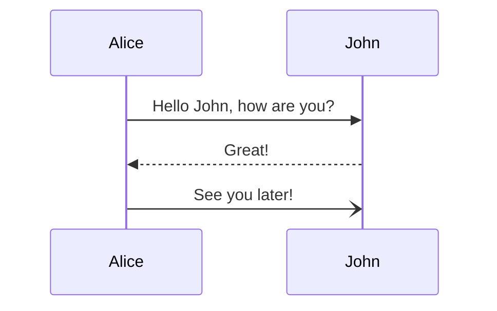

# algoritmed-telegram03
Algoritmed telegram chat-bot with FHIR-WorkFlow logic. 

Project "я з тобою" - з'єднування, пацієнта, психотерапевта, кращої лікарської практики, телекомунікаційними засобами разом, особливо під час війни.

## Інсталяція

База даних

> http://algoritmed.com/db/mis001pg/
> Postgres
> 
> Налаштування мікросервісу : створити application.properties, користуючись шаблоном application copy.properties
> 
> Налаштувати datasource 
> spring.datasource.url=jdbc:postgresql://localhost/mis001pg

Telegram chat-bot

> дивись офіційну інструкцію реєстрації чат-бот телеграм
> Використання username та token дивись файл шаблоном конфігурації application copy.properties

Для розгортання необхідно Java, git, gradle

> Версія Java дивись build.gradle файл, актуальна 11 .
> 
> Варіанти запуску мікросервісу 
>> Напряму: > gradle bootRun
>> 
>> Через створення окремого скомпільованого пакунку, jar файл: > gradle clean build

https://github.blog/2022-02-14-include-diagrams-markdown-files-mermaid/

https://gist.github.com/martinwoodward/8ad6296118c975510766d80310db71fd

